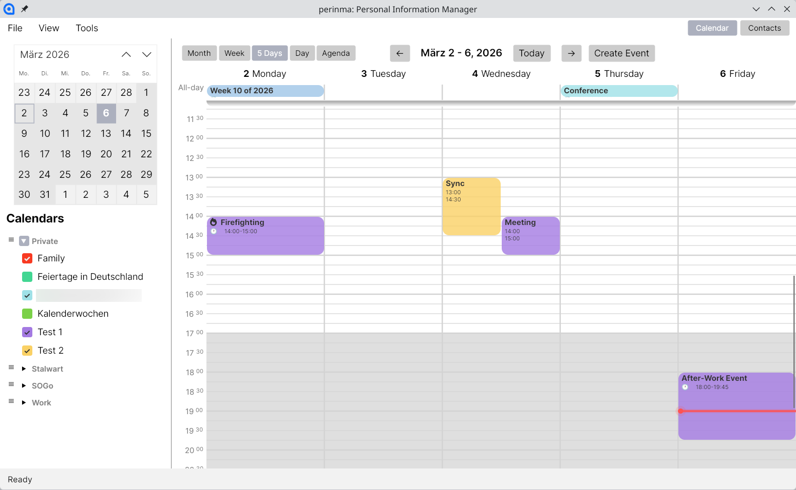

# Perinma

Perinma is a Personal Information Manager. It's goal is to provide what eM Client or Outlook provide in an opensource package.
It is being developed in C# using Avalonia as UI framework, making it cross platform. The focus is (at the moment) purely on desktop and will target (for now) only Linux, Mac and Windows.



## Installation

Just download one of the artifacts from the releases section; preferably for the platform you want to use it on.

## Known issues / todos / future features

- [ ] Allow creating and editing recurring events
  - Override individual occurrences
  - Remove individual occurrences
  - Undo individual overrides/removals
  - Edit "parent" events
  > ⚠️ Beware with editing recurring events currently. This will likely not behave properly and might ruin the event you edit.
- [ ] Contact editing/creation
- [ ] Calendar management (create and edit calendars)
- [ ] Contact group management (create and edit contact groups)
- [ ] Emails
  > ℹ️ Yes, that's a big one. It will also likely require including a WebView to render HTML mails.
  >
  > A full features richtext editor will also be quite an effort. 

## Development [](https://ci.aksdb.de/repos/2)

### Prerequisites

- [mise](https://mise.jdx.dev/) - Development environment tool
- Google OAuth Client ID (for Google Calendar integration)

### Environment Variables

This project uses mise to manage environment variables. Set up your Google OAuth Client ID:

```bash
mise set -E local GOOGLE_CLIENT_ID=your-client-id-here.apps.googleusercontent.com
mise set -E local GOOGLE_CLIENT_SECRET=the-matching-secret
```

To get a Google OAuth Client ID:
1. Go to [Google Cloud Console](https://console.cloud.google.com/apis/credentials)
2. Create a new OAuth 2.0 Client ID
3. Set the application type to "Desktop app"
4. Copy the Client ID and secret

### Prepare build

Run `mise prepare-secrets` to generate the build time secrets file.

### Building

```bash
dotnet build
```

mise will automatically inject the environment variables when you run commands in the project directory.

### Running

```bash
dotnet run --project src/perinma.csproj
```

## FAQ

### Why another PIM?

While Thunderbird, KDE PIM and Evolution exist, they all don't quite fit my personal taste. They also don't fit in any tech stack I like to work with, so I decided for rolling my own (yes, NIH is strong) instead of trying to shape the others into my personal direction.

### Doesn't it look a lot like eM Client?

Might be. Let's say eM Client inspired me heavily. If eM Client was available for Linux, I might not even have set out to develop Perinma. But I wanted what they offer, but on the platform of my choice (Linux). If you are on Mac and/or Windows only, eM Client might be the better choice, since it's an impressively complex and well designed software and I assume it will take a while for Perinma to catch up.

### "Your code sucks"

That's unfortunately very possible. I am developing software for over 20 years, having started with Visual Basic, then Delphi, then Visual C# (good old WinForms), but then my professional life shiftd into backend development with Java and Go for the previous 15 years.

As you might notice in the repository name, this isn't the first attempt to develop Perinma. My first attempt was in Go using the great Fyne UI framework, but I felt like fighting too much against that framework to get the visuals I want. My thinking is just too much inheritance-based when it comes to GUI, and Go doesn't do that (and shouldn't have to).

I have never worked with the MVVM pattern before, though, so it's quite hard to wrap my head around it when building my mental models for how to implement things. I have certain expectations from my time with Delphi and WinForms and those typically don't pan out nicely with MVVM.

I am aware that such a project might not be the ideal start to learn a new paradigm, but I am motivation-driven and it's *this* project that motivates me, not something else, so I have to deal with the steep learning curve now.

After my initial implementations like the CalendarView ended up being heavy spaghetti code, I started to use coding agents to get some other features boot-strapped. I could dig through stackoverflow and tons of examples myself to come up with "how to properly test in C#" or "how to structure a component in AXML" or whatever, but the coding agents turned out to write quite okayish code for my taste. They give me something to reason about and iterate on. No, I am not vibe-coding this. I give my agents specific tasks and read the code they write and complain about it if it looks shitty or overcomplicated. I rework parts of the code while shaking my head about why the heck it did something so weird, but that motivates me more than working a vacuum where I am simply not fluent enough to come up with the basics on my own (simply because C# is too long ago, has evolved too much and I have no deep understanding of AXML and MVVM yet).

Still, as a result, the code is evolving and different components are implemented differently because I learned along the way and haven't had the motivation to refactor the old ones. For now I want to get shit done. Feel free to give me feedback about things that are non-idiomatic.

### "Your code is non-idiomatic"

Most of the cases: tell me about it. One thing though, I deliberately changed against "better" knowledge: I bundle Views and ViewModels into their own directories; one per "component"/"module". I did this, because I really detest bundling things by technical boundaries (Views vs ViewModels) instead of business boundaries ("MainWindow" vs "Settings", for example). It really irks me seeing other Avalonia projects where there is *one* large directory with 40 Views and another large directory with 40 ViewModels. That just doesn't track for me and only ends up in me scrolling between the file list in my IDE all the time. So even if *that* is the default for MVVM projects, I decided to do it differently and I think my approach is objectively better. Sue me.

If other things are non-idiomatic: tell me, though.

### Wait, you said you use "AI"?

Yes. I make use of coding agents. This is a side project and I want to see progress. Coding agents help me with that; a lot. I don't trust them. I don't just give them a "make it work" task. I formulate small requirements and let them implement small iterations. They give me something to reason about, which motivates me a lot more than having to come up with something completely from scratch. I rather take what they give me and rework it than having to figure out all the basics. I (think I) have enough experience to judge code quality and have a (hopefully good) gut feeling about which implementations are plausible or what should be done differently. If something looks off, I intervene. If something can be done simpler, I rewrite it simpler. But at least I can do that iteratively now and still get an intermediate result that gives me the dopamine kick I need to keep going.

### Can I contribute?

Sure. I would appreciate if you start a quick discussion first, before starting a new feature. I may already have a vision and I would be a bit torn if I get a large PR that says "I put a lot of work in it" which I would like to honor by accepting it, but on the other hand it conflicts with what I want in the system.

Also if the change involves a bigger refactoring: talk to me first. I said I am not deeply familiar with MVVM, Avalonia or even modern C#, but I might still have a reason to do what I do (see code structure discussed above).

As I said, though, I want to get stuff done and more hands/brains can get more stuff done. So in general I am open to contributions.